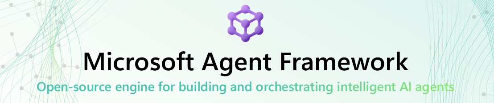
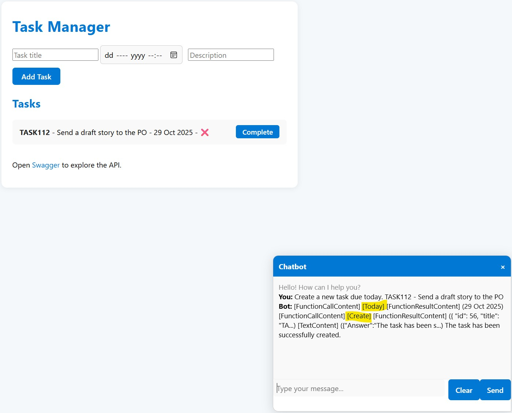

- [Task Manager with an Assistant]({{ '/.' | relative_url }})


Usually, I’m skeptical about using the latest tech for no real reason — but this time, it’s worth it.

## Why Migrate

The **Agent Framework (AF)** is essentially **Semantic Kernel (SK) 2.0** — simpler, cleaner, and less verbose.  
The boilerplate is reduced, and the code reads better.

I initially implemented AF to run **side-by-side** with SK so I could compare them easily. While that worked, I eventually **rewrote everything using AF**, and the result was **much more organized and readable**.

While the SK version wasn’t bad, I believe the benefits of AF will be more visible in **larger, more complex systems**.

## What’s New

The **Agent Framework** introduces **several new features** that make development easier and more flexible.

One particularly useful example is **Structured Output**.

In my **Task Manager** use case, I need the assistant to return a **JSON** response containing both the text answer and a list of tasks.

With SK, I had to manually extract the task list from the function result or even from the assistant’s own text if it decided to recall from memory.  
AF solves this neatly with its **built-in structured output support** — no extra parsing required.

```c#
    var response = await _agent.RunAsync<AskResponse>(question, _thread);
    
    return response.Result;
```

Even though the **LLM is the same**, the assistant in AF seems **smarter and more coordinated** when calling tools in the right order to achieve the desired goal.  
For example, I no longer need to store **today’s date** in the beginning of the chat history — the assistant is **smart enough to fetch it itself** and use it when needed.



## Compatibility

All the good features from SK remain available and compatible.  
For example, you can still use the familiar **InMemoryVectorStore**, so migration is straightforward.

## Conclusion

The **Agent Framework** is truly the **next iteration** of Semantic Kernel — more efficient, cleaner, and just better overall.  
If you’re already using SK, I highly recommend migrating.

Feel free to check out the [Pull Request](https://github.com/kiril-vassilev/task-manager-with-assistant/pull/2) for the migration details.
