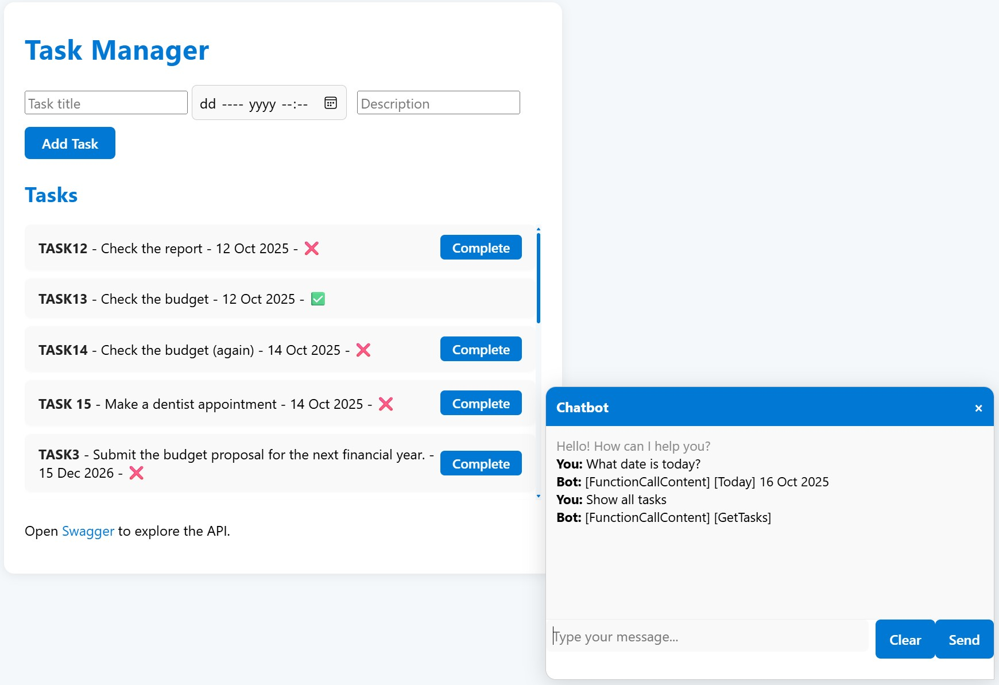

This is a simple example of a system that manages your tasks (**Title**, **Description**, **Due Date**, and **Is-Completed** flag) with a built-in chatbot. There’s also a human interface (a.k.a. UI — the usual buttons and fields where you can enter tasks), but the idea is to use the chatbot for everything except presenting the tasks. In other words, the goal is to be *user-interface-less* — that’s the future, isn’t it?

The chatbot (along with the current chat history) can be opened using the button in the bottom-left corner — as usual. It’s worth mentioning the **Clear** button, which starts a new multi-turn conversation by wiping the current one. This can be useful, since the assistant gets a little ‘smarter’ with every turn — and you might not always want that. It ‘remembers’ what you’ve asked for, and if you request the same or similar data again, it might skip using the system tools and instead reply from the chat history. You can also type `Clear`, or — if you’ve watched too many movies — `Forget about it`.


Overall, this is a traditional layered solution — with a **Data Layer (DAL)**, **Business Layer (BLL)**, **Domain Layer**, and of course the UI — the **Presentation Layer**, which in this case is a single-page web application.

Within the **BLL**, I’ve added a new sublayer — let’s call it the **Assistant Layer**. Without interfering with the traditional ways of using the system (via the UI or API), it provides unique insight and a natural way of helping you out — just what a helpful assistant is supposed to do.

                        +-------------------------------+
                        |      Presentation Layer       |
                        |   (UI - Single Page App)      |
                        +-------------------------------+
                                        |
                        +-------------------------------+
                        |         Domain Layer          |
                        |   (Business Objects, Logic)   |
                        +-------------------------------+
                                        |
                        +-------------------------------+
                        |      Business Layer (BLL)     |
                        |  +-------------------------+  |
                        |  |   Assistant Layer       |  |  <-- Chatbot/AI Assistant
                        |  +-------------------------+  |
                        |  (Rules, Processes, API)      |
                        +-------------------------------+
                                        |
                        +-------------------------------+
                        |        Data Layer (DAL)       |
                        |   (Database, Data Access)     |
                        +-------------------------------+


By design, it helps you in three major arias and of course, a combination of them.

# How to use the system – Read the manual

The least challenging work is feeding the assistant the user manual, which gives ability to answer questions about how to use the system:

-  How can I add a new task;
-  How can I mark a task as complete;


# Utilize the system – Do it for me

Exposing the system's API to the assistant truly enriches the user experience with quite a few new options, some of them even I didn't expect:

## Creating new tasks

-  Create a task (following the validation rules, it will ask you for **title**, **description** and **due date** in the future);


-  Create multiple tasks;


-  Creating a new task - due today; 


While working on the system, I once asked the assistant to create a new task due today. At first, I was surprised by its response — `today’s date is in 2023`. Then I realized — of course it doesn’t know! How would it? I have a watch, a phone, and a computer that all show the date, but the assistant has no such reference. 

The issue hadn’t come up earlier because, for simplicity, all date filters were implemented to search for tasks due in the past, today, or in the future. Since those checks are handled by the system’s internal tools, they don’t require the assistant to actually know today’s date. Similarly, the **create new task** tool already knows whether the due date is in the future or not.

In the end, I gave the assistant a tool to check today’s date — which, of course, can also be used by the user:

-   What date is today?


The filters can be improved to work with any date (including **yesterday**, **today**, and **tomorrow**), and that’ll probably be one of my next steps — but for now, I find it kind of cool to leave it as it is.

## Deleting and Completing tasks

-   Delete TASK1 (It will make sure you know what are you doing so it will not do it without user’s confirmation);
-   Delete TASK1 - again (If you try to delete it again, within the same conversation, you will get a reminder – it has been deleted already.  If a new conversation is initiated, it will check and tell you, it does not exist);
-   Delete all tasks; 


## Retriving all tasks

-   Get me TASK1 (find by title);
-   Is there a TASK1?;
-   Get me TASK1 and TASK6;
-   Get me all tasks;
-   What do I have to do today?;
-   Get me all tasks that are overdue and not completed;
-   Are there any tasks that are due in the future but already completed?


## Searching throughout the tasks’ descriptions – Are there any tasks like…

All tasks are added to in-memory vector store, which makes possible for the assistant to make semantic searches.

-   Do I have to do something like...;
-   Are there anything about...;
-   Get me all tasks that are like... and overdue but not completed;


If you keep the chat history, at some point it will start ‘remembering’:


As cool as it sounds, one should be careful because the user can still modify the data using the traditional way, bypassing the assistant, which means the ‘remembered’ data might be outdated.

# How I Did It — and What I Learned

Obviously, the system is far from *never-seen-before* techniques or approaches. The choices are based mostly on convenience, and the general idea of keeping it simple and readable – especially for people like me - accustomed to the traditional way of building software.

## Prompting

Prompting is the newest martial art — and you’d better get your black belt. You’ve probably heard the saying: *“The computer does what you tell it to do, not what you want it to do”*. That’s literally true for LLMs.

Give clear, unambiguous, and *as-specific-as-possible* instructions — and please, do everybody a favor - don't make spelling mistakes.

```c#
    Instructions =
    "You are a helpful assistant that manages tasks " +
    "and answer the user's questions about how to use the system using the manual. " +
    "Each task has a title, description, due date, and iscompleted status." +
    "The title is not descriptive for the task." +
    "The description describes what the task is for and what the user is supposed to do." +
    "The due date is when the task is supposed to be done by." +
    "The iscompleted status shows if the task is done or not." +
    "Use ToolsPlugin - 'Today' function to get the today's date, when asked or when creating a new task with due date today." +
    "Use ToolsPlugin - 'Clear' function to clear the chat history and context or when asked to start over or forget everything." +
    "Use TasksSearchPlugin  - 'SearchAsync' function to search for specific task or tasks." +
    "Use it to answer questions about tasks such as: " +
    "- Are there tasks like <description>?" +
    "- Do I have to do something like <description>?" +
    "- Do I have to do something like <description>? which is overdue and not completed?" +
    "- Get me all tasks that are like <description> and are overdue and completed." +
    "Use TaskServicePlugin to get all tasks, get a task by title, mark a task as complete, " +
    "Use TaskServicePlugin - 'GetAllTasks' function to answer questions about tasks such as: " +
    "- Are there any tasks due today?" +
    "- Are there any overdue tasks?" +
    "- Do I have any tasks that are not completed?" +
    "- Do I have any tasks that are overdue and not completed?" +
    "- Get me all overdue tasks." +
    "- Get me all tasks that are overdue and not completed." +
    "Use TaskServicePlugin to delete a task (Make sure to confirm with the user before deleting), " +
    "or to create a new one. " +
    "Always answer in this format: " +
    ReadFileResource("AskResponse.json") +
    "This is the Task Manager Manual for reference: " +
    ReadFileResource("Manual.txt"),
```

## Technologies

Generally, the system is developed using Microsoft techologies:

-   C#, Razor Pages UI, JavaScript
-   Visual Studio Code (with the help of the Copilot – gpt-5-mini)
-   GitHub
-   Gpt-4o
-   Text-embeding-3-large
-   Semantic  Kernel

# Next steps

As I said a couple of times, there are plenty of things to improve. 

## Improving the filters to use any date

The date filters for both **Search** and **GetAllTasks** support: 
**0 - no filter**, **1 - only past due**, **2 - only due today**, **3 - only due in future**
Would be nice, to have **filterDate** and **0 - no filter**, **1 - after**, **2 - before**, **3 - equal** and since the assistant knows **Today**, let it worry about **Tomorrow**, **Yesterday**, **the day after tomorrow** (Great movie by the way) etc.

## Adding more domains

I want to add a Users domain. A user can be assigned a task and will have different rights – **admin**, **assign tasks**, **read only** etc. Of course, this domain will get its own assistant, and on top of the whole system, we will have an agent with access to both user and task assistants so it can perform even more complex queries involving all the domains.

## Testing

Testing a chatbot is a challenge - especially if you want to automate it. Mostly because the answers are not *black-and-white* as in a traditional software system. I mean, you cannot simply **Assert.Equal(42, the_meaning_of_life_the_universe_and_everything)**. 
I want to experiment with a dedicated agent which checks and validates the chatbot answers.

## Security

First, I want to implement a **Police** agent, helping secure the system access. Second, I want to demonstrate an idea of partitioning – securing the data so **User1** cannot see or work with **User2** tasks and vice versa. The idea is simply to have a separate assistant (with separate vector database and separate set of tools) per user. Like this, the assistant cannot give you access or knowledge of something it does not have.

# Conclusion

Thanks for reading! Please stay tuned for more, and of course, any feedback, comments, and suggestions are welcome.
